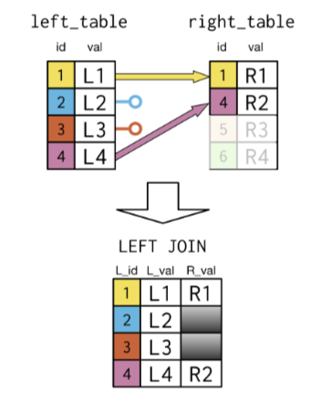
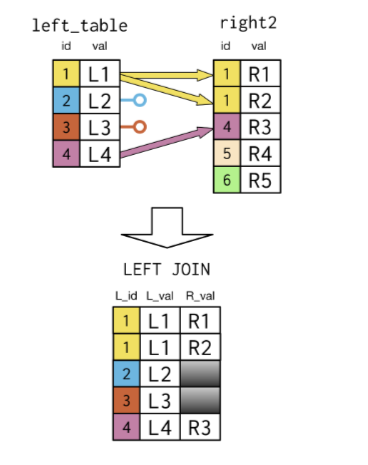
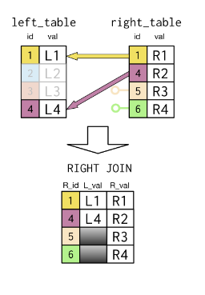
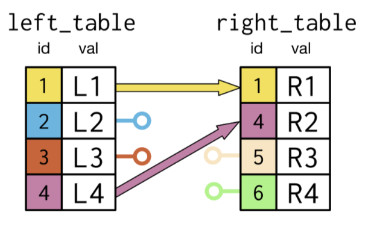
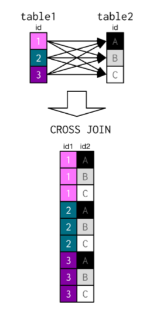

# Joining Data in SQL

## The INNER JOIN 

Only includes records in which the key is located in both of the tables

### Syntax

```SQL
SELECT *
FROM left_table
INNER JOIN right_table
ON left_table.id = right_table.id;
```

### Sample Code

```SQL
SELECT p1.country, p1.continent, 
       prime_minister, president
FROM prime_minister as p1
INNER JOIN president as p2
on p1.country = p2.country;
```

## Joining multiple tables 

### Sample Code

```SQL
SELECT *
FROM left_table
  INNER JOIN right_table
    ON left_table.id = right_table.id
  INNER JOIN another_table
    ON left_table.id = another_table.id;
```

```SQL
-- Select fields
SELECT c.code, name, region, e.year, fertility_rate, unemployment_rate
  -- From countries (alias as c)
  FROM countries AS c
  -- Join to populations (as p)
  INNER JOIN populations AS p
    -- Match on country code
    ON c.code = p.country_code
  -- Join to economies (as e)
  INNER JOIN economies AS e
    -- Match on country code and year
    ON (c.code = e.code) AND (e.year = p.year);
```

## The USING keyword

If the attribute on which join is being performed; has the same name in both the tables then we can use the USING keyword to perform the join.

## SELF JOIN

```SQL
SELECT p1.country, p2.country, p1.continent
FROM countries as p1
INNER JOIN countries as p2
ON p1.continent = p2.continent;
```

## The CASE WHEN and THEN keywords

<b><u>CASE:</u></b><br>
CASE can be thought of as IF and ELSE conditional statements.

### Sample Code

```SQL
SELECT name, contient, year
    CASE WHEN year < 1900 THEN 'before 1900'
    WHEN year <= 1930 THEN 'after 1930'
    ELSE 'after 1930' END
    AS year_group
FROM table_name
ORDER BY year_group;
```

## Creating a new table using the INTO keyword

The INTO keyword takes the results of the query and puts them into a new-seperate table.
```SQL
SELECT country_code, size,
  CASE WHEN size > 50000000
            THEN 'large'
       WHEN size > 1000000
            THEN 'medium'
       ELSE 'small' END
       AS popsize_group
INTO pop_plus       
FROM populations
WHERE year = 2015;
```

The INTO keyword comes before FROM.

# Sample Code Snippets

```SQL
SELECT  left_table.id AS L_id,
        left_table.val as L_val,
        right_table.val as R_val

FROM left_table
INNER JOIN right_table
USING (id);
```

## The OUTER JOIN

#### Types of OUTER JOINS

1. LEFT JOIN
2. RIGHT JOIN
3. FULL JOIN

### The LEFT JOIN

Consider the INNER JOIN 
It displays the output table with matching keys in both the tables.
Now the LEFT JOIN keeps track of the entries in the left table that do not match with the ones in the right.

A LEFT JOIN keeps all the values in the left table but marks them missing for the corresponding right values that don't have a match.



One left table value may also map to multiple values in the right table as shown below



#### Syntax

```SQL
SELECT p1.country, prime_minister, persident,
FROM prime_ministers as p1
LEFT JOIN presidents as p2
ON p1.country = p2.country;
```


### The RIGHT JOIN

In SQL the Right table appears after the RIGHT JOIN clause and the left table appears after the FROM clause.



#### Syntax

```SQL
SELECT right_table.id as r_id,
       left_table.id as l_id,
       right_table.val as r_val
FROM left_table AS left
RIGHT JOIN right_table AS right
ON left_table.id = right_table.id;
```

### The FULL JOIN

It brings the entire data from both the tables.

#### Syntax

```SQL
SELECT left_table.id AS l_id, right_table.id as r_id, left_table.val as l_val, right_table.val as r_val
FROM left_table
FULL JOIN right_table
USING (id);
```


### The CROSS JOIN 

The CROSS JOIN takes two tables as an input and outputs a table that consists of all possible combinations of the data values in the two input tables.

Since the output table is a table containing all the possible combinations, we do not need to specify a joining attribute.




```SQL
SELECT name, country, region 
FROM table_one
CROSS JOIN table_two
WHERE region IN ('Pakistan', 'Qatar');
```


       

